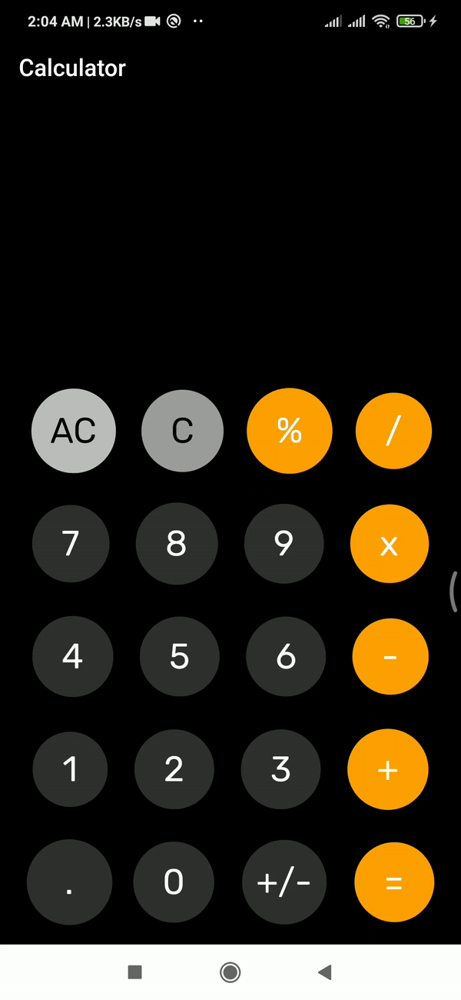
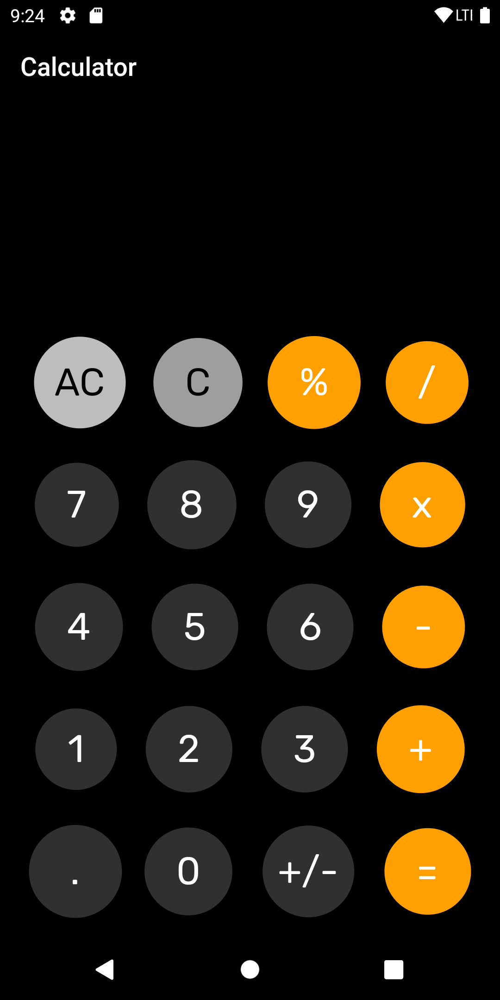
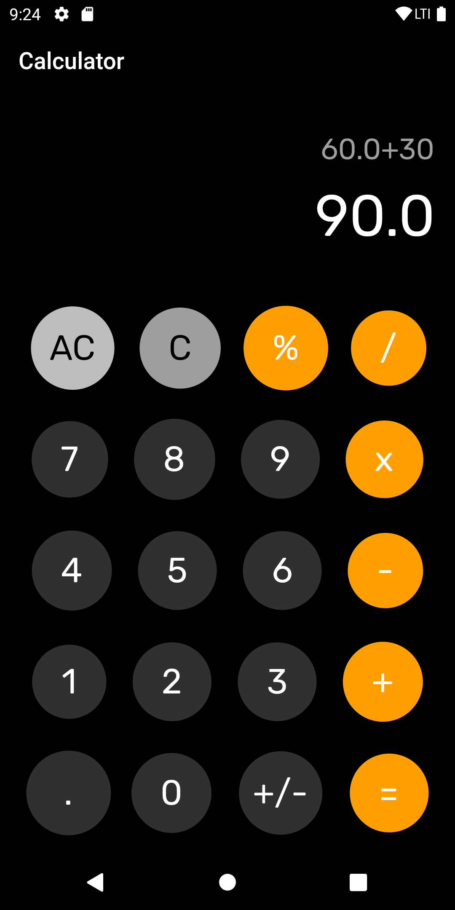

# Calculator App

This is a simple Flutter application where I have create a simple calculator UI and also add functionality to this app. So this is an fully working calculator app. For making this app I use provider state management and use math expressions flutter pakage to make app functional.

## Live Site: <a href="https://karno786.github.io/Calculator/" target="_blank">Calculator Site</a>

## APP WORKING GIF

## Screenshots:

### 01. APP UI

### 02. APP UI

### 03. APP UI

### Disclaimer
This project is made only for educational purpose. Anyone can use it but the risk has to be taken by the user.
for any query please contact me.

### Repository Owner Info

__Md. Al-Amin__  
__Email :__ [ alamin.karno@outlook.com ](mailto:alamin.karno@outlook.com)  
__Github :__ [Md. Al-Amin](https://github.com/karno786) 
__Facebook :__ [মোঃ আল-আমিন খন্দকার কর্ণ](https://facebook.com/alamin.kanro786)  
__Linkedin :__ [Md. Alamin Karno](https://www.linkedin.com/in/alaminkarno/)
 
 